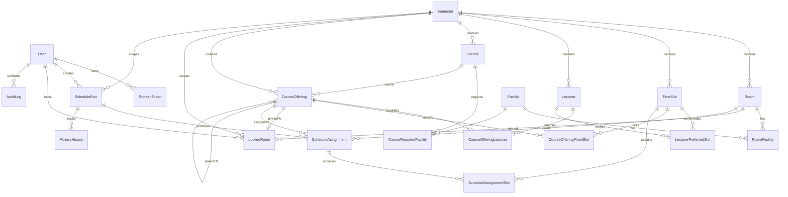

# API and Database Design Document
## UPJ GA Scheduler v2 — Backend Service

| Field | Value |
|---|---|
| **Version** | 1.0 |
| **Status** | Design — pending implementation |
| **Companion Documents** | `techspec_upj_scheduler_v2.md` (arc42 v2.0), `src/types.ts`, `src/db/seed.ts` |
| **Audience** | Backend implementer, thesis examiner |
| **Author Role** | Backend Architect |

---

## 1. Overview

### 1.1 Purpose

This document specifies the HTTP API surface, persistence schema (Prisma), and authentication/authorization model for the UPJ GA Scheduler v2 backend. It is the contract between the React frontend (techspec §5.1) and the three-layer scheduling pipeline (techspec §4.1: Pre-GA → SSA → GA).

### 1.2 Scope

**In scope:**
- Prisma schema covering every entity referenced by the techspec and `src/types.ts`.
- REST API for all CRUD entities, scheduler orchestration, auth, and run inspection.
- Two-role auth (admin / user) with a complete permission matrix.
- Asynchronous job execution model for GA runs (techspec §7.1, `[ARCH-OBS-02]`).
- Live progress streaming for in-progress GA runs.

**Out of scope:**
- Frontend implementation, including the `LockRoomModal` and `SSAFailurePanel` UI (techspec §9).
- Multi-faculty federation (techspec §2.3).
- Integration with SIAK or other UPJ academic systems (techspec §3.2).
- The internal mechanics of the Pre-GA, SSA, and GA layers — those are already specified in the techspec and implemented under `src/`.

### 1.3 Alignment with the techspec

This design extends the data model already implied by `src/types.ts` and the Prisma fragments in techspec §5.4 (`LockedRoom`) and §8.2 (`GARun`). It does **not** introduce a parallel data model. The techspec's compile-time `Gene` discriminated union (`FixedRoomGene | FlexibleGene`) remains an in-memory construct only — chromosomes are persisted as serialized JSON in the audit record (techspec §7.2 Redis schema, §8.2 `GARun.historyJson`). The DB stores the *result* of a run (assignments + history), not the live chromosome.

### 1.4 Roles at a glance

| Role | Maps to techspec §8.1 | Purpose |
|---|---|---|
| `admin` | `ADMIN` | Full control: facility/timeslot management, user administration, locked rooms, scheduling, manual overrides. |
| `user` | `HEAD_OF_PROGRAM_STUDY` (Kaprodi) | Curates teaching data (lecturers, courses, offerings, student counts) and runs the GA on their own scheduling jobs. |

---

## 2. Architecture Context

The API is a thin transport layer over the existing pure-function pipeline under `src/pre-ga/`, `src/ssa/`, and `src/ga/`. A scheduling request never blocks an HTTP worker — it is enqueued onto a job queue (BullMQ on Redis), executed by a worker process, and observed by the client either through polling or a live stream.

```
┌──────────────┐                ┌────────────────────────────────┐
│  React SPA   │  HTTPS/JSON    │  Express API  (port 3000)       │
│  (Vite)      │ ─────────────► │  /api/v1/*                       │
│              │ ◄───────────── │  - auth, validation, RBAC        │
└──────────────┘                │  - CRUD handlers (Prisma)        │
       │                        │  - POST /schedule-runs ──┐       │
       │ SSE/WS                 └──────────────────────────┼──┬───┘
       │  (progress)                                        │  │
       │                          enqueue(runId) via BullMQ│  │
       ▼                                                    ▼  │
┌────────────────────────┐             ┌────────────────────────┐
│  GET /schedule-runs/   │ ◄── pub/sub │  Redis                 │
│       :id/stream       │             │  - BullMQ queue        │
│  (SSE channel)         │             │  - GA checkpoints      │
└────────────────────────┘             │  - pub/sub channels    │
                                       └─────────┬──────────────┘
                                                 │
                                                 ▼
                            ┌──────────────────────────────────────┐
                            │  Worker process (same monorepo)       │
                            │                                       │
                            │   runPreGA() → runSSA() → runGA()     │
                            │   (techspec §6.1)                     │
                            │                                       │
                            │   on each generation:                 │
                            │     ─ checkpoint Redis (every 10g)    │
                            │     ─ publish progress event          │
                            │   on completion:                      │
                            │     ─ persist ScheduleRun + Assignments│
                            │     ─ persist FitnessHistory          │
                            └──────────────────────┬────────────────┘
                                                   │
                                                   ▼
                                       ┌────────────────────────┐
                                       │  PostgreSQL  (Prisma)  │
                                       └────────────────────────┘
```

**Why a queue and not a synchronous handler?** Techspec §1.2 P1 budget is "< 10 minutes" per run, with §7.1 noting GA runs of 2–5 minutes that block the Node event loop. Holding an HTTP request open that long fails behind any reverse proxy idle timeout (typically 60s for nginx/Cloudflare) and prevents horizontal scaling. The queue model also enables `POST /schedule-runs/:id/cancel` and live progress streaming.

**Why PostgreSQL not SQLite/libSQL?** The techspec references SQLite/libSQL (constraint table §2.1). For thesis-defense reproducibility, SQLite is acceptable; for any deployment beyond a single laptop (multiple Kaprodi sessions, the queue worker process, Redis-backed concurrency), Postgres is recommended. This is flagged as **OQ-3** in §9. The Prisma schema below is portable between the two — only the `provider` line in `datasource db` changes.

---

## 3. Database Design (Prisma)

### 3.1 Mapping summary: `src/types.ts` → Prisma

| TS type (src/types.ts) | Prisma model | Notes |
|---|---|---|
| `Room` | `Room` | `facilities: string[]` → `Facility[]` join table (normalized for indexing) — see migration note 3.5. |
| `TimeSlot` | `TimeSlot` | 1:1; `day` becomes a `Weekday` enum. |
| `Lecturer` | `Lecturer` | `preferredTimeSlotIds: number[]` → `LecturerPreferredSlot` join table. |
| `Course` | `Course` | `requiredFacilities: string[]` → join with `Facility`. |
| `CourseOffering` | `CourseOffering` | `lecturers: Lecturer[]` → `CourseOfferingLecturer` join (team teaching). `isFixed` and `fixedTimeSlotIds` retained for **techspec-mandated** Fixed Room semantics — they shadow the `LockedRoom` table (see 3.5). |
| `PreGACandidate` | *not persisted* | In-memory only; rebuilt at run-time inside `runPreGA()`. |
| `SSAResult` | `ScheduleRun.ssaResultJson` | Serialized; matches techspec §8.2. |
| `GAResult` | `ScheduleRun.*` + `FitnessHistory[]` + `ScheduleAssignment[]` | `history[]` and `avgHistory[]` are normalized to a child table for query-friendly charts; the raw JSON is also retained per techspec §8.2 for compatibility. |
| `SchedulerResponse` | DTO, not persisted | Composed on read from `ScheduleRun`. |

### 3.2 Full Prisma schema

```prisma
// prisma/schema.prisma
//
// Aligned to techspec_upj_scheduler_v2.md §5.4, §8.2, and src/types.ts.
// Database: PostgreSQL recommended (see design doc §2 / OQ-3).

generator client {
  provider = "prisma-client-js"
}

datasource db {
  provider = "postgresql"      // Swap to "sqlite" for the thesis-defense build.
  url      = env("DATABASE_URL")
}

// ─── Auth ─────────────────────────────────────────────────────────

enum Role {
  ADMIN
  USER
}

model User {
  id            Int       @id @default(autoincrement())
  email         String    @unique
  passwordHash  String
  fullName      String
  role          Role      @default(USER)
  isActive      Boolean   @default(true)
  createdAt     DateTime  @default(now())
  updatedAt     DateTime  @updatedAt
  lastLoginAt   DateTime?

  refreshTokens RefreshToken[]
  scheduleRuns  ScheduleRun[]
  lockedRooms   LockedRoom[]
  auditLogs     AuditLog[]

  @@index([role])
  @@index([isActive])
  @@map("users")
}

model RefreshToken {
  id          String   @id @default(cuid())
  userId      Int
  tokenHash   String   @unique          // SHA-256 of the opaque token; never store the raw token
  expiresAt   DateTime
  revokedAt   DateTime?
  userAgent   String?
  ipAddress   String?
  createdAt   DateTime @default(now())

  user        User     @relation(fields: [userId], references: [id], onDelete: Cascade)

  @@index([userId])
  @@index([expiresAt])
  @@map("refresh_tokens")
}

// ─── Facility / Calendar configuration ────────────────────────────

model Semester {
  id            Int      @id @default(autoincrement())
  code          String   @unique          // e.g., "2025-GANJIL"
  label         String                    // e.g., "Semester Ganjil 2025/2026"
  startsOn      DateTime
  endsOn        DateTime
  isActive      Boolean  @default(false)  // Exactly one row should be active.
  createdAt     DateTime @default(now())
  updatedAt     DateTime @updatedAt

  rooms          Room[]
  timeSlots      TimeSlot[]
  lecturers      Lecturer[]
  courses        Course[]
  offerings      CourseOffering[]
  lockedRooms    LockedRoom[]
  scheduleRuns   ScheduleRun[]

  @@index([isActive])
  @@map("semesters")
}

model Facility {
  id     Int    @id @default(autoincrement())
  code   String @unique                    // 'LAB', 'PROJECTOR', 'STUDIO' (matches src/db/seed.ts)
  label  String

  rooms          RoomFacility[]
  courses        CourseRequiredFacility[]

  @@map("facilities")
}

model Room {
  id          Int      @id @default(autoincrement())
  semesterId  Int
  name        String
  capacity    Int
  createdAt   DateTime @default(now())
  updatedAt   DateTime @updatedAt

  semester    Semester       @relation(fields: [semesterId], references: [id], onDelete: Cascade)
  facilities  RoomFacility[]
  offerings   CourseOffering[]
  lockedRooms LockedRoom[]

  @@unique([semesterId, name])
  @@index([semesterId])
  @@map("rooms")
}

model RoomFacility {
  roomId      Int
  facilityId  Int

  room        Room      @relation(fields: [roomId], references: [id], onDelete: Cascade)
  facility    Facility  @relation(fields: [facilityId], references: [id], onDelete: Restrict)

  @@id([roomId, facilityId])
  @@map("room_facilities")
}

enum Weekday {
  MONDAY
  TUESDAY
  WEDNESDAY
  THURSDAY
  FRIDAY
  SATURDAY
  SUNDAY
}

model TimeSlot {
  id          Int      @id @default(autoincrement())
  semesterId  Int
  day         Weekday
  startTime   String   // 'HH:MM' — kept as string to match src/types.ts:TimeSlot.startTime
  endTime     String

  semester    Semester @relation(fields: [semesterId], references: [id], onDelete: Cascade)
  preferredBy LecturerPreferredSlot[]
  assignments ScheduleAssignmentSlot[]

  @@unique([semesterId, day, startTime, endTime])
  @@index([semesterId])
  @@map("time_slots")
}

// ─── People & curriculum ──────────────────────────────────────────

model Lecturer {
  id              Int      @id @default(autoincrement())
  semesterId      Int
  name            String
  isStructural    Boolean  @default(false)        // techspec §2.2 — soft constraint
  createdAt       DateTime @default(now())
  updatedAt       DateTime @updatedAt
  createdById     Int?                             // who entered this record (audit)

  semester        Semester                  @relation(fields: [semesterId], references: [id], onDelete: Cascade)
  preferredSlots  LecturerPreferredSlot[]
  offerings       CourseOfferingLecturer[]

  @@index([semesterId])
  @@index([isStructural])
  @@map("lecturers")
}

model LecturerPreferredSlot {
  lecturerId  Int
  timeSlotId  Int

  lecturer    Lecturer  @relation(fields: [lecturerId], references: [id], onDelete: Cascade)
  timeSlot    TimeSlot  @relation(fields: [timeSlotId], references: [id], onDelete: Cascade)

  @@id([lecturerId, timeSlotId])
  @@map("lecturer_preferred_slots")
}

model Course {
  id           Int      @id @default(autoincrement())
  semesterId   Int
  code         String                            // e.g., 'IF101'
  name         String
  sks          Int                               // credit hours
  createdAt    DateTime @default(now())
  updatedAt    DateTime @updatedAt
  createdById  Int?

  semester           Semester                  @relation(fields: [semesterId], references: [id], onDelete: Cascade)
  requiredFacilities CourseRequiredFacility[]
  offerings          CourseOffering[]

  @@unique([semesterId, code])
  @@index([semesterId])
  @@map("courses")
}

model CourseRequiredFacility {
  courseId    Int
  facilityId  Int

  course      Course   @relation(fields: [courseId], references: [id], onDelete: Cascade)
  facility    Facility @relation(fields: [facilityId], references: [id], onDelete: Restrict)

  @@id([courseId, facilityId])
  @@map("course_required_facilities")
}

model CourseOffering {
  id                    Int      @id @default(autoincrement())
  semesterId            Int
  courseId              Int
  roomId                Int                              // proposed default; may be overridden by LockedRoom
  effectiveStudentCount Int                              // techspec §1.3 — used to derive requiredSessions
  isFixed               Boolean  @default(false)         // mirrors src/types.ts CourseOffering.isFixed
  parentOfferingId      Int?                             // for parallel-split (Sesi A / Sesi B)
  createdAt             DateTime @default(now())
  updatedAt             DateTime @updatedAt
  createdById           Int?

  semester        Semester                  @relation(fields: [semesterId], references: [id], onDelete: Cascade)
  course          Course                    @relation(fields: [courseId], references: [id], onDelete: Restrict)
  room            Room                      @relation(fields: [roomId], references: [id], onDelete: Restrict)
  parent          CourseOffering?           @relation("ParallelSplit", fields: [parentOfferingId], references: [id])
  children        CourseOffering[]          @relation("ParallelSplit")
  lecturers       CourseOfferingLecturer[]
  fixedSlots      CourseOfferingFixedSlot[]
  lockedRoom      LockedRoom?
  assignments     ScheduleAssignment[]

  @@index([semesterId])
  @@index([courseId])
  @@index([roomId])
  @@index([parentOfferingId])
  @@map("course_offerings")
}

model CourseOfferingLecturer {
  offeringId  Int
  lecturerId  Int

  offering    CourseOffering @relation(fields: [offeringId], references: [id], onDelete: Cascade)
  lecturer    Lecturer       @relation(fields: [lecturerId], references: [id], onDelete: Restrict)

  @@id([offeringId, lecturerId])
  @@map("course_offering_lecturers")
}

// CourseOffering.fixedTimeSlotIds[] in src/types.ts → join table
model CourseOfferingFixedSlot {
  offeringId  Int
  timeSlotId  Int

  offering    CourseOffering @relation(fields: [offeringId], references: [id], onDelete: Cascade)
  timeSlot    TimeSlot       @relation(fields: [timeSlotId], references: [id], onDelete: Cascade)

  @@id([offeringId, timeSlotId])
  @@map("course_offering_fixed_slots")
}

// ─── Lock Room (techspec §5.4 / FR-01) ────────────────────────────

model LockedRoom {
  id          Int            @id @default(autoincrement())
  semesterId  Int
  offeringId  Int            @unique          // one offering ↔ one lock
  roomId      Int
  lockedById  Int
  lockedAt    DateTime       @default(now())
  reason      String?

  semester    Semester       @relation(fields: [semesterId], references: [id], onDelete: Cascade)
  offering    CourseOffering @relation(fields: [offeringId], references: [id], onDelete: Cascade)
  room        Room           @relation(fields: [roomId], references: [id], onDelete: Restrict)
  lockedBy    User           @relation(fields: [lockedById], references: [id], onDelete: Restrict)

  @@index([semesterId])
  @@index([roomId])
  @@map("locked_rooms")
}

// ─── Scheduling runs (extends techspec §8.2 GARun) ────────────────

enum RunStatus {
  QUEUED            // accepted by API, waiting for worker
  RUNNING           // pipeline executing
  COMPLETED         // GA finished; assignments persisted
  STAGNATED         // exited early per techspec §6.3 stagnation rule
  SSA_INFEASIBLE    // SSA rejected the dataset
  PRE_GA_EMPTY      // techspec §6.1 step 9 — NO_FEASIBLE_CANDIDATES
  CANCELLED         // explicit cancel by user
  FAILED            // unhandled error
}

model ScheduleRun {
  id                String     @id @default(cuid())
  semesterId        Int
  createdById       Int
  status            RunStatus  @default(QUEUED)
  configJson        String     // serialized GAConfig (src/types.ts) — single source of truth
  ssaResultJson     String?    // serialized SSAResult; null until SSA runs
  preGASummaryJson  String?    // {feasible: number, infeasible: [...]}; matches SchedulerResponse.preGASummary

  // Live progress (mirrors GAResult from src/types.ts)
  currentGeneration Int        @default(0)
  generationsRun    Int        @default(0)
  bestFitness       Float      @default(0)
  hardViolations    Int        @default(0)
  softPenalty       Int        @default(0)
  stagnatedEarly    Boolean    @default(false)

  // Raw history retained for techspec §8.2 compatibility; also normalized below.
  historyJson       String     @default("[]")
  avgHistoryJson    String     @default("[]")

  durationMs        Int?
  errorCode         String?    // 'AC3_DOMAIN_EMPTY' | 'BIPARTITE_MATCHING_INSUFFICIENT' | ...
  errorMessage      String?

  startedAt         DateTime?  // null while QUEUED
  completedAt       DateTime?
  createdAt         DateTime   @default(now())
  updatedAt         DateTime   @updatedAt

  // Idempotency for run creation (see §7).
  idempotencyKey    String?    @unique

  semester     Semester             @relation(fields: [semesterId], references: [id], onDelete: Restrict)
  createdBy    User                 @relation(fields: [createdById], references: [id], onDelete: Restrict)
  assignments  ScheduleAssignment[]
  fitness      FitnessHistory[]

  @@index([semesterId])
  @@index([createdById])
  @@index([status])
  @@index([startedAt])
  @@map("schedule_runs")
}

// One row per CourseOffering in the winning chromosome.
// Each ScheduleAssignment then points to >= 1 TimeSlot via the join below
// (because requiredSessions = ⌈effectiveStudentCount / roomCapacity⌉ may be > 1).
model ScheduleAssignment {
  id              Int      @id @default(autoincrement())
  runId           String
  offeringId      Int
  roomId          Int                       // resolved room (locked or evolved)
  isFixedRoom     Boolean                   // gene.kind === 'FIXED'
  manualOverride  Boolean  @default(false)  // true if a Kaprodi/admin edited it post-run
  overriddenById  Int?
  overriddenAt    DateTime?
  notes           String?
  createdAt       DateTime @default(now())
  updatedAt       DateTime @updatedAt

  run         ScheduleRun              @relation(fields: [runId], references: [id], onDelete: Cascade)
  offering    CourseOffering           @relation(fields: [offeringId], references: [id], onDelete: Restrict)
  slots       ScheduleAssignmentSlot[]

  @@unique([runId, offeringId])
  @@index([runId])
  @@map("schedule_assignments")
}

model ScheduleAssignmentSlot {
  assignmentId  Int
  timeSlotId    Int

  assignment    ScheduleAssignment @relation(fields: [assignmentId], references: [id], onDelete: Cascade)
  timeSlot      TimeSlot           @relation(fields: [timeSlotId], references: [id], onDelete: Restrict)

  @@id([assignmentId, timeSlotId])
  @@map("schedule_assignment_slots")
}

// Normalized fitness history — one row per generation.
// Matches GAResult.history and GAResult.avgHistory in src/types.ts.
model FitnessHistory {
  id              Int      @id @default(autoincrement())
  runId           String
  generation      Int
  bestFitness     Float
  avgFitness      Float
  hardViolations  Int
  softPenalty     Int
  recordedAt      DateTime @default(now())

  run             ScheduleRun @relation(fields: [runId], references: [id], onDelete: Cascade)

  @@unique([runId, generation])
  @@index([runId])
  @@map("fitness_history")
}

// ─── Audit log ────────────────────────────────────────────────────

model AuditLog {
  id          Int      @id @default(autoincrement())
  actorId     Int?                          // null for system events
  action      String                        // e.g., 'user.create', 'schedule_run.cancel'
  entityType  String                        // e.g., 'User', 'ScheduleRun', 'LockedRoom'
  entityId    String                        // stringified id (covers both Int and String IDs)
  metadata    String?                       // JSON-serialized diff or context
  ipAddress   String?
  userAgent   String?
  createdAt   DateTime @default(now())

  actor       User?    @relation(fields: [actorId], references: [id], onDelete: SetNull)

  @@index([actorId])
  @@index([entityType, entityId])
  @@index([createdAt])
  @@map("audit_logs")
}
```

### 3.3 Entity reference

Each entry below: purpose · key fields · relationships · indexes · TS-type mapping.

| Model | Purpose | Maps to |
|---|---|---|
| `User` | Authenticated principal. Either `ADMIN` or `USER`. | New entity. |
| `RefreshToken` | Server-side record of issued refresh tokens (rotation + revocation). | New entity. |
| `Semester` | Tenant boundary for all scheduling data; the active semester scopes the GA run. | Implicit in techspec §1.3 (one active semester at a time). |
| `Facility` | Normalized facility tag (`LAB`, `PROJECTOR`, `STUDIO`). | `Room.facilities[]`, `Course.requiredFacilities[]`. |
| `Room` | Physical room with capacity and facilities. | `src/types.ts:Room`. |
| `TimeSlot` | A weekly recurring slot within a semester. | `src/types.ts:TimeSlot`. |
| `Lecturer` | Person who teaches; flagged structural for soft-constraint penalty. | `src/types.ts:Lecturer`. |
| `Course` | Curriculum entry with credit and facility requirements. | `src/types.ts:Course`. |
| `CourseOffering` | A scheduled instance of a course in a semester. | `src/types.ts:CourseOffering`. |
| `CourseOfferingLecturer` | Team-teaching join (techspec §1.3 #4). | `CourseOffering.lecturers[]`. |
| `CourseOfferingFixedSlot` | Slots locked when `isFixed=true`. | `CourseOffering.fixedTimeSlotIds[]`. |
| `LockedRoom` | Kaprodi-pinned `(offering, room)` lock from FR-01. | techspec §5.4 — extended with `semesterId`, `reason`. |
| `ScheduleRun` | One execution of the Pre-GA → SSA → GA pipeline. | techspec §8.2 `GARun`, plus `SchedulerResponse` and `GAResult`. |
| `ScheduleAssignment` | Final placement of one offering in the winning chromosome. | `Gene` (post-run, persisted form). |
| `ScheduleAssignmentSlot` | The 1+ time slots that an assignment occupies. | `Gene.assignedTimeSlotIds[]`. |
| `FitnessHistory` | Per-generation row for chart queries. | `GAResult.history[]` + `GAResult.avgHistory[]`. |
| `AuditLog` | Tamper-evident trail of admin and user actions. | New entity (techspec §3.2 calls for a thesis audit log). |

### 3.4 ER diagram



### 3.5 Migration notes

| Existing artifact | Status | Action |
|---|---|---|
| `src/types.ts:Room` | 1:1, except `facilities: string[]` | Migrate string array to `Facility` + `RoomFacility`. Keep a TS adapter `roomToType(room)` that returns `facilities: string[]` for the GA core, which expects a flat array. |
| `src/types.ts:TimeSlot` | 1:1 | `day: string` becomes `Weekday` enum at the DB layer; the API DTO continues to expose the string form for the GA. |
| `src/types.ts:Lecturer` | 1:1 | `preferredTimeSlotIds: number[]` → `LecturerPreferredSlot`. |
| `src/types.ts:Course` | 1:1 | `requiredFacilities: string[]` → `CourseRequiredFacility`. |
| `src/types.ts:CourseOffering` | Mostly 1:1, **conflict** | The TS type carries `isFixed` and `fixedTimeSlotIds`, while techspec §5.4 introduces a separate `LockedRoom` table populated by FR-01. **Resolution**: keep both. `CourseOffering.isFixed/fixedSlots` represents *intrinsic* fixedness asserted at data-entry time (e.g., a course administratively pinned for the whole semester), while `LockedRoom` represents an FR-01 *manual* lock applied by the Kaprodi prior to a specific run. The Pre-GA `entityTagger` already merges both signals (techspec §5.4) — the resulting `PreGACandidate.isFixedRoom` is the single source of truth for the GA. |
| `src/db/seed.ts` | In-memory only | Convert to a Prisma seed script that upserts a single `Semester` (`2025-GANJIL`) and inserts the same six rooms, fifteen time slots, eight lecturers, eleven courses, and fifteen offerings. The `infeasibleOfferings` set should be guarded behind a `--with-infeasible` flag — useful for integration tests, harmful in production. |
| GA core under `src/ga/`, `src/pre-ga/`, `src/ssa/` | No change | These modules consume plain TS types and remain Prisma-unaware (techspec §5.2). The API service layer adapts Prisma rows → TS types before invoking `runPreGA`, `runSSA`, `runGA`. |
| Redis checkpoint schema (techspec §7.2) | No change | Already specified verbatim in the techspec; only its *trigger* changes — the worker writes checkpoints, not an HTTP handler. |

---

## 4. Authentication & Authorization

### 4.1 Mechanism choice

**JWT access tokens + opaque refresh tokens, with bcrypt password hashing.**

| Choice | Justification |
|---|---|
| Stateless JWT access token (15 min) | Lets the API and the BullMQ worker both validate requests without a DB roundtrip — important because the worker re-checks ownership before persisting overrides. |
| Opaque, server-side refresh token (7 days, single-use, rotated on refresh) | Storing refresh tokens hashed in `RefreshToken` enables instant revocation (e.g., admin deactivates a user mid-run) — JWT alone cannot. |
| bcrypt with cost factor 12 | Industry default; resistant to GPU brute force at this cost; 250–400ms hash time on commodity hardware is acceptable for an interactive login. |
| HS256 for JWT signing | Symmetric is sufficient because the API and worker share infrastructure. RS256 would only matter if a third party needed to verify tokens. The signing key lives in `JWT_SECRET` (env). |

### 4.2 Token storage

**Access token:** `Authorization: Bearer <jwt>` header. **Refresh token:** httpOnly, Secure, SameSite=Strict cookie scoped to `/api/v1/auth`.

Justification: Pairing a short-lived header-based access token with a cookie-based refresh token gives us the best of both worlds — the access token is invisible to most CSRF vectors (it must be explicitly attached by JS), and the refresh token is invisible to XSS (httpOnly). The Kaprodi typically uses a single browser session; cross-origin SPA usage is not in scope.

### 4.3 Auth flow

```
┌────────┐                              ┌──────────┐                    ┌────────┐
│ Client │                              │   API    │                    │   DB   │
└───┬────┘                              └─────┬────┘                    └────┬───┘
    │ 1. POST /auth/register   (admin only) │                              │
    │ ──────────────────────────────────────►│ verify caller is ADMIN      │
    │                                       │ bcrypt.hash(password, 12) ──►│ INSERT users
    │                                       │ ◄────── User row             │
    │ 2. POST /auth/login                   │                              │
    │ ──────────────────────────────────────►│ bcrypt.compare              │
    │                                       │ sign JWT (15m)               │
    │                                       │ create refresh token (7d) ──►│ INSERT refresh_tokens
    │ ◄── 200 { user, accessToken }         │                              │
    │     Set-Cookie: refreshToken=...      │                              │
    │                                       │                              │
    │ 3. GET /schedule-runs                 │                              │
    │   Authorization: Bearer <jwt>          │                              │
    │ ──────────────────────────────────────►│ verify JWT, requireAuth     │
    │ ◄── 200 [...]                         │                              │
    │                                       │                              │
    │ 4. (15 min later) GET ... → 401       │                              │
    │ 5. POST /auth/refresh  (cookie)       │                              │
    │ ──────────────────────────────────────►│ look up tokenHash ─────────►│
    │                                       │ ◄── valid, not revoked       │
    │                                       │ revoke old, issue new pair  │
    │ ◄── 200 { accessToken } + new cookie  │                              │
    │                                       │                              │
    │ 6. POST /auth/logout                  │                              │
    │ ──────────────────────────────────────►│ revoke refresh token ──────►│ UPDATE revokedAt
    │ ◄── 204 + clear cookie                │                              │
```

### 4.4 Password policy

- Minimum 10 characters; must contain ≥1 letter and ≥1 digit (the academic context does not justify draconian symbol requirements that drive password reuse).
- Stored only as `bcrypt` hash in `User.passwordHash`; raw password never logged.
- Rate-limit `/auth/login` to 5 attempts per IP per 15 minutes; lock the user account after 10 consecutive failures (re-enabled by an admin via `PATCH /users/:id`).

### 4.5 Permission matrix

`-` = denied / 401 if anonymous · `R` = read · `W` = write (create/update) · `D` = delete · `O` = own only · `*` = all rows.

| Resource / Action | `admin` | `user` | `anonymous` |
|---|:---:|:---:|:---:|
| `POST /auth/login` | ✅ | ✅ | ✅ |
| `POST /auth/refresh` | ✅ | ✅ | ✅ (with valid cookie) |
| `POST /auth/logout` | ✅ | ✅ | – |
| `GET /auth/me` | ✅ | ✅ | – |
| `POST /auth/register` (create user) | ✅ | – | – |
| `GET /users`, `GET /users/:id` | R\* | – | – |
| `PATCH /users/:id` (role / activation) | W\* | – | – |
| `DELETE /users/:id` (soft-deactivate) | D\* | – | – |
| `GET/POST/PATCH/DELETE /semesters` | RWD | R | – |
| `POST /semesters/:id/activate` | W | – | – |
| `GET/POST/PATCH/DELETE /rooms` | RWD | R | – |
| `GET/POST/PATCH/DELETE /timeslots` | RWD | R | – |
| `GET/POST/PATCH/DELETE /facilities` | RWD | R | – |
| `GET/POST/PATCH/DELETE /locked-rooms` | RWD | R | – |
| `GET /lecturers`, `GET /lecturers/:id` | R\* | R\* | – |
| `POST /lecturers` | W | W | – |
| `PATCH /lecturers/:id` | W | W (non-structural fields only — see 4.6) | – |
| `DELETE /lecturers/:id` | D | – | – |
| `GET /courses`, `GET /courses/:id` | R\* | R\* | – |
| `POST /courses` | W | W | – |
| `PATCH /courses/:id` | W | W | – |
| `DELETE /courses/:id` | D | – | – |
| `GET /course-offerings` | R\* | R\* | – |
| `POST /course-offerings` | W | W | – |
| `PATCH /course-offerings/:id` (full) | W | – | – |
| `PATCH /course-offerings/:id/student-count` | W | W | – |
| `DELETE /course-offerings/:id` | D | – | – |
| `GET /schedule-runs` | R\* | R\* (own only — server filters by `createdById`) | – |
| `POST /schedule-runs` | W | W | – |
| `GET /schedule-runs/:id` | R\* | R(O) | – |
| `GET /schedule-runs/:id/stream` | R\* | R(O) | – |
| `POST /schedule-runs/:id/cancel` | W\* | W(O) | – |
| `DELETE /schedule-runs/:id` | D\* | D(O) | – |
| `PUT /schedule-runs/:id/assignments/:aid` (manual override) | W\* | W(O) | – |
| `GET /audit-logs` | R\* | – | – |
| `GET /health`, `GET /ready` | ✅ | ✅ | ✅ |

**Field-level rule for `user` editing `Lecturer` / `Course`** (referenced in row "PATCH /lecturers/:id"):
- `user` may set: `name`, `preferredTimeSlotIds`, `course.code`, `course.name`, `course.sks`, `course.requiredFacilities`.
- `user` may **not** set: `Lecturer.isStructural` (academic policy attribute), `Lecturer.semesterId`/`Course.semesterId` (only admin chooses semester), or any field on `Room`/`TimeSlot`/`LockedRoom`/`Semester`/`User`.

### 4.6 Middleware design

```
requireAuth(req, res, next)
  └── verifies `Authorization: Bearer <jwt>`; rejects 401 on missing/invalid.
      Attaches `req.user = { id, role, email }`.

requireRole(role: 'admin' | 'user')
  └── runs after requireAuth; rejects 403 if req.user.role !== role.
      `requireRole('admin')` is the most common gate.

requireOwnerOrAdmin(loadResource: (req) => Promise<{createdById: number}>)
  └── runs after requireAuth; allows admins always; for `user` checks
      that the loaded resource's createdById === req.user.id, else 403.

allowFields(allowList: string[])
  └── strips request body keys not in allowList. Used to enforce
      field-level restrictions on Lecturer/Course/CourseOffering when
      the caller is `user`.

rateLimitAuth, rateLimitRun
  └── per-route token-bucket limiters; see techspec §7.1 (5 GA runs / 5min).
```

---

## 5. API Design

### 5.1 Conventions

- **Base path:** `/api/v1`. All endpoints are JSON-only.
- **Request bodies:** `application/json`. Validation at the boundary using Zod (§6).
- **Response envelope:**
  - Success: `{ "data": <T>, "meta"?: { ... } }` for collection responses; bare `<T>` for single-resource reads.
  - Error: `{ "error": { "code": "<MACHINE_CODE>", "message": "<human>", "details"?: <object> } }` — matches techspec §8.3.
- **Pagination:** `?page=1&pageSize=50` (default 1/50, max 200). Response `meta` includes `{ page, pageSize, total }`.
- **Filtering & sorting:** `?filter[field]=value&sort=field,-otherField`. Listed per endpoint where supported.
- **Idempotency:** `Idempotency-Key` header on `POST /schedule-runs` (mapped to `ScheduleRun.idempotencyKey`).
- **Request IDs:** every response carries `X-Request-Id`; same value flows into logs and `AuditLog.metadata`.

### 5.2 HTTP status code policy

| Code | Used for |
|---|---|
| 200 | Successful GET, PATCH, PUT |
| 201 | Successful POST that created a resource |
| 202 | `POST /schedule-runs` — accepted into queue |
| 204 | Successful DELETE, logout |
| 400 | Malformed request, schema validation failure |
| 401 | Missing or invalid auth |
| 403 | Authenticated but not authorized |
| 404 | Resource not found, or `user` querying someone else's run |
| 409 | Idempotency conflict, unique constraint violation, illegal state transition (e.g., cancel a COMPLETED run) |
| 422 | Domain rejection: `NO_FEASIBLE_CANDIDATES`, `SSA_INFEASIBLE`, `AC3_DOMAIN_EMPTY`, `BIPARTITE_MATCHING_INSUFFICIENT` (techspec §8.3) |
| 429 | Rate limit exceeded |
| 500 | Unhandled internal error |
| 503 | Worker queue unavailable, DB unreachable |

### 5.3 Endpoint catalog

#### 5.3.1 Auth

| Method | Path | Role | Purpose |
|---|---|---|---|
| POST | `/auth/register` | admin | Create a new user. |
| POST | `/auth/login` | anonymous | Exchange credentials for tokens. |
| POST | `/auth/refresh` | anonymous (cookie) | Rotate refresh token, return new access token. |
| POST | `/auth/logout` | any auth | Revoke active refresh token. |
| GET | `/auth/me` | any auth | Return current principal. |

**`POST /auth/register`** — admin-only. (See OQ-1 about whether self-registration is desirable.)
- Request: `{ "email": string, "password": string, "fullName": string, "role": "admin" | "user" }`
- Response 201: `{ "id": number, "email": string, "fullName": string, "role": Role, "isActive": true, "createdAt": ISO8601 }`
- Errors: 400 weak password / invalid email; 409 email already used.

**`POST /auth/login`**
- Request: `{ "email": string, "password": string }`
- Response 200: `{ "user": <Me>, "accessToken": string, "expiresIn": 900 }`. Sets `Set-Cookie: refreshToken=<opaque>; HttpOnly; Secure; SameSite=Strict; Path=/api/v1/auth; Max-Age=604800`.
- Errors: 400 schema; 401 `INVALID_CREDENTIALS`; 403 `ACCOUNT_DISABLED`; 429.

**`POST /auth/refresh`**
- Request: cookie only (no body).
- Response 200: `{ "accessToken": string, "expiresIn": 900 }`. New refresh-token cookie issued; old one revoked.
- Errors: 401 `REFRESH_TOKEN_INVALID` (also clears cookie).

**`POST /auth/logout`**
- Response 204; clears cookie; revokes the matching `RefreshToken` row.

**`GET /auth/me`**
- Response 200: `{ "id": number, "email": string, "fullName": string, "role": Role, "lastLoginAt"?: ISO8601 }`.

---

#### 5.3.2 Users (admin only)

| Method | Path | Purpose |
|---|---|---|
| GET | `/users` | List users (paginated, sortable by `createdAt`, filterable by `role` and `isActive`). |
| GET | `/users/:id` | Get one user. |
| PATCH | `/users/:id` | Update `role`, `fullName`, or `isActive`. Cannot change `email` (see OQ-2). |
| DELETE | `/users/:id` | Soft-deactivate (sets `isActive=false`; preserves audit trail). |

`PATCH` body: any subset of `{ "role": Role, "fullName": string, "isActive": boolean }`. Errors: 403 if attempting to demote oneself; 404 if missing.

---

#### 5.3.3 Semesters (admin write, user read)

| Method | Path | Purpose |
|---|---|---|
| GET | `/semesters` | List. |
| GET | `/semesters/:id` | Read one. |
| POST | `/semesters` | Create. Body: `{ code, label, startsOn, endsOn }`. |
| PATCH | `/semesters/:id` | Update `label`, `startsOn`, `endsOn`. `code` is immutable post-create. |
| POST | `/semesters/:id/activate` | Set this row's `isActive=true` and unset all others atomically. |
| DELETE | `/semesters/:id` | 409 if any related rows exist or it is active. |

---

#### 5.3.4 Rooms, TimeSlots, Facilities, LockedRooms (admin write, user read)

Standard CRUD. Bodies match the Prisma fields directly.

- `POST /rooms` body: `{ "semesterId": number, "name": string, "capacity": number, "facilities": string[] }`. Response 201 returns the row with `facilities` resolved to `string[]` for compatibility with `src/types.ts`.
- `POST /timeslots` body: `{ "semesterId": number, "day": Weekday, "startTime": "HH:MM", "endTime": "HH:MM" }`.
- `POST /locked-rooms` body: `{ "semesterId": number, "offeringId": number, "roomId": number, "reason"?: string }`. The server fills `lockedById` from `req.user.id`. 409 if a lock already exists for that offering. Locked rooms cannot be created or modified while any `ScheduleRun` for the same semester is `RUNNING` (techspec §2.1: locks must be committed before a run starts).

#### 5.3.5 Lecturers (admin + user, with field restrictions)

| Method | Path | Role | Body |
|---|---|---|---|
| GET | `/lecturers` | both | – |
| GET | `/lecturers/:id` | both | – |
| POST | `/lecturers` | both | `{ semesterId, name, isStructural?, preferredTimeSlotIds?: number[] }` — `user` cannot set `isStructural` (server forces `false`). |
| PATCH | `/lecturers/:id` | both | Same fields; `user` cannot change `isStructural`. |
| DELETE | `/lecturers/:id` | admin | 409 if referenced by any `CourseOfferingLecturer`. |

The `allowFields` middleware drops `isStructural` from a `user` request body before Prisma sees it. This is asserted with a 400 + warning when the field is present and the caller is a user (so the client can correct the UI).

#### 5.3.6 Courses (admin + user)

Standard CRUD. Body: `{ semesterId, code, name, sks, requiredFacilities: string[] }`. Both roles may create and update; only admin may delete (parallels Lecturer).

#### 5.3.7 CourseOfferings (admin + user, with field restrictions)

| Method | Path | Role | Notes |
|---|---|---|---|
| GET | `/course-offerings` | both | Filterable by `courseId`, `roomId`, `lecturerId`, `parentOfferingId`. |
| GET | `/course-offerings/:id` | both | – |
| POST | `/course-offerings` | both | Body: `{ semesterId, courseId, roomId, effectiveStudentCount, lecturerIds: number[], isFixed?: boolean, fixedTimeSlotIds?: number[], parentOfferingId?: number }`. `user` may not set `isFixed` or `fixedTimeSlotIds` (server forces `false` / omits). |
| PATCH | `/course-offerings/:id` | admin | Full edit. |
| PATCH | `/course-offerings/:id/student-count` | both | Body: `{ effectiveStudentCount: number }`. The narrow endpoint exists explicitly so a `user` can update enrollment data without inheriting full-edit privileges. |
| DELETE | `/course-offerings/:id` | admin | – |

#### 5.3.8 ScheduleRuns

`user` can only see and act on rows where `createdById === req.user.id`. `admin` can see all.

**`POST /schedule-runs`** — enqueue a pipeline run.
- Headers: `Idempotency-Key: <uuid>` (recommended; required if the caller is a worker re-trying).
- Request:
  ```json
  {
    "semesterId": 1,
    "config": {
      "populationSize": 100,
      "generations": 200,
      "mutationRate": 0.05,
      "elitismCount": 4,
      "tournamentSize": 5,
      "crossoverType": "uniform",
      "noiseRate": 0.1,
      "hardPenaltyWeight": 100,
      "softPenaltyWeight": 1
    }
  }
  ```
  The `config` object is exactly `GAConfig` from `src/types.ts` plus the `hardPenaltyWeight` / `softPenaltyWeight` fields the techspec §4.3 mandates (`[ARCH-OBS-01]`).
- Response 202:
  ```json
  {
    "id": "ck123…",
    "status": "QUEUED",
    "semesterId": 1,
    "createdById": 7,
    "createdAt": "2025-08-12T03:14:00Z"
  }
  ```
- Errors: 400 schema; 409 `IDEMPOTENCY_CONFLICT` (same key, different body); 422 `NO_ACTIVE_SEMESTER` if the semester has no offerings; 429 if user exceeds 5 runs / 5 min (techspec §7.1); 503 if the queue is unreachable.

**`GET /schedule-runs`** — list.
- Query: `?status=COMPLETED&semesterId=1&page=1&pageSize=20&sort=-createdAt`. `user` automatically gets `createdById = me`.
- Response 200: `{ "data": ScheduleRunSummary[], "meta": {...} }` where `ScheduleRunSummary` omits the heavy JSON fields.

**`GET /schedule-runs/:id`** — full read.
- Response 200 (`SchedulerResponse` extension):
  ```json
  {
    "id": "ck123…",
    "status": "COMPLETED",
    "config": GAConfig,
    "preGASummary": { "feasible": 15, "infeasible": 4 },
    "ssaResult": SSAResult,
    "gaResult": {
      "bestFitness": 0.972,
      "hardViolations": 0,
      "softPenalty": 28,
      "stagnatedEarly": false,
      "generationsRun": 142,
      "history": [0.41, 0.55, ...],
      "avgHistory": [0.18, 0.31, ...]
    },
    "assignments": [
      {
        "id": 87,
        "offeringId": 6,
        "roomId": 3,
        "isFixedRoom": true,
        "manualOverride": false,
        "slots": [{ "id": 1, "day": "MONDAY", "startTime": "08:00", "endTime": "10:00" }],
        "offering": { "id": 6, "courseCode": "IF301", "courseName": "Rekayasa Perangkat Lunak", "lecturers": [...] }
      }
    ],
    "durationMs": 124300,
    "createdAt": "...",
    "completedAt": "..."
  }
  ```
- Errors: 404 if not found, or if `user` and not the owner.

**`GET /schedule-runs/:id/stream`** — Server-Sent Events. Recommendation: SSE over WebSocket (OQ-4) — the channel is one-way (worker → client), SSE auto-reconnects on the browser side, and there is no need for client-driven messages here. The HTTP request stays open and emits:
- `event: progress`, `data:` `{ runId, status, currentGeneration, generationsRun, bestFitness, hardViolations, softPenalty, history, avgHistory }`. Emitted at most once per generation.
- `event: state`, `data:` `{ runId, status }` whenever status transitions (QUEUED → RUNNING → COMPLETED/etc.).
- `event: error`, `data:` `{ code, message, details? }` on failure.
- Heartbeat: a comment line every 15s to defeat proxy idle timeouts.

The endpoint terminates the stream on COMPLETED, FAILED, CANCELLED, SSA_INFEASIBLE, PRE_GA_EMPTY, or STAGNATED.

**`POST /schedule-runs/:id/cancel`**
- Response 200: `{ "id", "status": "CANCELLED" }`. Idempotent: cancelling an already-terminal run returns 409 `ILLEGAL_STATE_TRANSITION`.

**`DELETE /schedule-runs/:id`** — hard delete; cascades to assignments, slots, fitness history. 409 if `RUNNING` (must cancel first).

**`PUT /schedule-runs/:id/assignments/:assignmentId`** — manual override. **Permitted for admin always; permitted for the run's owner only if `status === COMPLETED`** (you cannot edit a stagnated/infeasible/cancelled run — those have no schedule to fix; you cannot edit a running run — race condition).
- Request: `{ "roomId"?: number, "timeSlotIds"?: number[], "notes"?: string }`
- The server marks `manualOverride=true`, sets `overriddenById` and `overriddenAt`, and writes an `AuditLog` entry.
- Validation: room and slot must belong to the same semester as the run; `timeSlotIds.length` must equal the offering's `requiredSessions` (computed per techspec §1.3).

#### 5.3.9 Health

| Method | Path | Purpose |
|---|---|---|
| GET | `/health` | Liveness. Returns `{ "status": "ok", "uptimeSec": 1234 }`. Always 200 if the process is up. |
| GET | `/ready` | Readiness. Returns 200 only when DB and Redis pings succeed; 503 otherwise. |

---

## 6. Validation & Error Handling

- **Request validation:** Zod schemas live in `src/api/schemas/*` and are mounted as middleware. Each route has exactly one schema; the schema is the source of truth for both runtime validation and the OpenAPI spec generation (via `zod-to-openapi`).
- **Centralized error handler:** A single Express error middleware converts thrown errors into the standard envelope. Categories:
  - `ValidationError` → 400 `VALIDATION_FAILED` + Zod issue list.
  - `AuthError` → 401 with concrete code (`INVALID_CREDENTIALS`, `REFRESH_TOKEN_INVALID`, ...).
  - `AuthzError` → 403 `FORBIDDEN`.
  - `NotFoundError` → 404 `NOT_FOUND`.
  - `ConflictError` → 409 with concrete code.
  - `DomainError` → 422 with concrete code; the techspec §8.3 codes (`NO_FEASIBLE_CANDIDATES`, `SSA_INFEASIBLE`, `AC3_DOMAIN_EMPTY`, `BIPARTITE_MATCHING_INSUFFICIENT`) live here.
  - Unknown → 500 `INTERNAL_ERROR`; full stack trace logged with the request ID, never returned to the client.
- **Request ID propagation:** `requestId` middleware reads `X-Request-Id` (or generates a UUID v4), attaches to `req.id`, mirrors back as a response header, threads into pino logger context, and is included in `AuditLog.metadata`.

---

## 7. Concurrency & Job Execution

- **Queue:** BullMQ on Redis (the same Redis used for the GA checkpoint cache, techspec §7.2 — separate keyspace). The queue is named `ga-pipeline`.
- **Worker process:** a sibling Node process spawned from the same monorepo (`npm run worker`). It imports `runPreGA`, `runSSA`, `runGA` directly — no network hop — so the existing pure-function contracts (techspec §5.2) are preserved.
- **Job lifecycle:**
  1. `POST /schedule-runs` → INSERT `ScheduleRun {status: QUEUED}` → `queue.add(runId)` → 202.
  2. Worker pulls the job, sets `status=RUNNING`, runs the pipeline.
  3. After each generation, the worker:
     - upserts a `FitnessHistory` row,
     - updates `ScheduleRun.currentGeneration / bestFitness / hardViolations / softPenalty / historyJson / avgHistoryJson`,
     - publishes to the `ga-progress:<runId>` Redis channel (consumed by the SSE handler),
     - every 10 generations, writes the Redis checkpoint per techspec §7.2.
  4. On completion, the worker writes `ScheduleAssignment` rows + slot joins, sets `status=COMPLETED` and `completedAt`, publishes a final `state` event.
- **Cancellation:** `POST /schedule-runs/:id/cancel` flips status to `CANCELLED`. The worker checks the cancellation flag at the top of every generation loop iteration and cleanly exits.
- **Idempotency:** `Idempotency-Key` is stored on `ScheduleRun.idempotencyKey` (unique). A retried `POST` with the same key and body returns the original 202; the same key with a different body returns 409.
- **Concurrency cap:** the queue is configured with `concurrency: 1` per Redis instance for the prototype — running two GAs simultaneously on the same machine would slow both. For multi-instance deployment, set concurrency to the number of CPU cores on the worker host.
- **Why not a worker thread?** A queue gives us per-run persistence, retry, cancellation, and horizontal scaling for the same engineering effort, and it is the path the techspec §7.1 `[ARCH-OBS-02]` already recommends. A `worker_threads` implementation would need a separate cancellation channel, a separate progress-streaming channel, and would still block on a single process.

---

## 8. Audit & Traceability

Every state-changing endpoint writes one `AuditLog` row. The `actorId` is `req.user.id` (or null for system events such as scheduled cleanup).

| Action | Triggered by | What is logged |
|---|---|---|
| `auth.login` | `POST /auth/login` | `{ email, success, ip, userAgent }` |
| `auth.login_failed` | `POST /auth/login` 401 | same as above with `success: false` |
| `auth.logout` | `POST /auth/logout` | `{ tokenId }` |
| `user.create` / `user.update` / `user.deactivate` | admin only | `{ before, after }` diff (passwordHash redacted) |
| `room.*`, `time_slot.*`, `facility.*`, `semester.*`, `locked_room.*` | admin only | `{ before, after }` |
| `lecturer.*`, `course.*`, `course_offering.*` | admin or user | `{ before, after, role }` (so we can tell which role changed which field) |
| `schedule_run.create` | admin or user | `{ semesterId, config }` |
| `schedule_run.cancel` / `schedule_run.delete` | admin or user | `{ status }` |
| `schedule_run.assignment_override` | admin or user (own run only) | `{ runId, assignmentId, before, after }` — **mandatory** for thesis empirical validation (techspec §3.2 calls this out as in-scope). |
| `schedule_run.completed` | system | `{ runId, durationMs, hardViolations, softPenalty }` |

Audit logs are append-only. Only `admin` can read `/audit-logs`. The table is indexed on `(entityType, entityId)` and `createdAt` so the frontend can show "history of changes for this offering / this run" cheaply.

---

## 9. Open Questions / Decisions for the User

| ID | Question | Default I have assumed |
|---|---|---|
| **OQ-1** | **Self-registration vs admin-invite.** I have specified admin-only `/auth/register`. For a thesis prototype with a tiny user base, this is appropriate, but if the examination committee expects open enrollment we should add a public `POST /auth/register` that always assigns role `user` (and is rate-limited and CAPTCHA-protected). | Admin-only registration. |
| **OQ-2** | **Email change flow.** `PATCH /users/:id` does not allow `email` updates. Email changes typically need a verify-new-email round-trip. Do we need this for the thesis, or is "create a new account" acceptable? | Email is immutable after creation. |
| **OQ-3** | **Postgres vs SQLite/libSQL.** Techspec §2.1 references SQLite/libSQL. The Prisma schema is portable (one `provider` line), but Postgres is required to make the BullMQ worker meaningful (file-locked SQLite + multi-process workers are fragile). The thesis defense build can keep SQLite by running the worker in-process; the production blueprint here assumes Postgres. Confirm which mode the document should foreground? | Document foregrounds Postgres + multi-process; SQLite single-process is documented as the thesis-defense fallback. |
| **OQ-4** | **SSE vs WebSocket for live progress.** I have chosen SSE because the channel is one-way and SSE has built-in browser auto-reconnect. If the frontend already uses WebSocket for anything else, we should consolidate on WS. | SSE. |
| **OQ-5** | **Manual override permission for `user`.** `PUT /schedule-runs/:id/assignments/:aid` is allowed for the run's owner when `status=COMPLETED`. Some thesis committees prefer "only admin can edit a generated schedule" to keep audit semantics clean. Confirm? | Owner-or-admin while COMPLETED. |
| **OQ-6** | **Token TTLs.** Access 15 min / refresh 7 days are sensible defaults, but the Kaprodi may run a single long session during exam-period scheduling. Adjust? | 15m / 7d. |
| **OQ-7** | **Soft-delete vs hard-delete for `User` and `ScheduleRun`.** I have specified soft-deactivate for users (preserves audit) and hard delete for schedule runs (with cascade). Confirm the run-deletion behaviour — for thesis empirical validation, you may prefer soft-delete on runs too. | User soft, run hard. |
| **OQ-8** | **`isFixed` vs `LockedRoom` redundancy.** Section 3.5 keeps both because the techspec keeps both, but it is a real source of confusion. Should we deprecate `CourseOffering.isFixed` post-migration and treat `LockedRoom` as the single source of truth? | Keep both, document the merge in `entityTagger`. |

---
